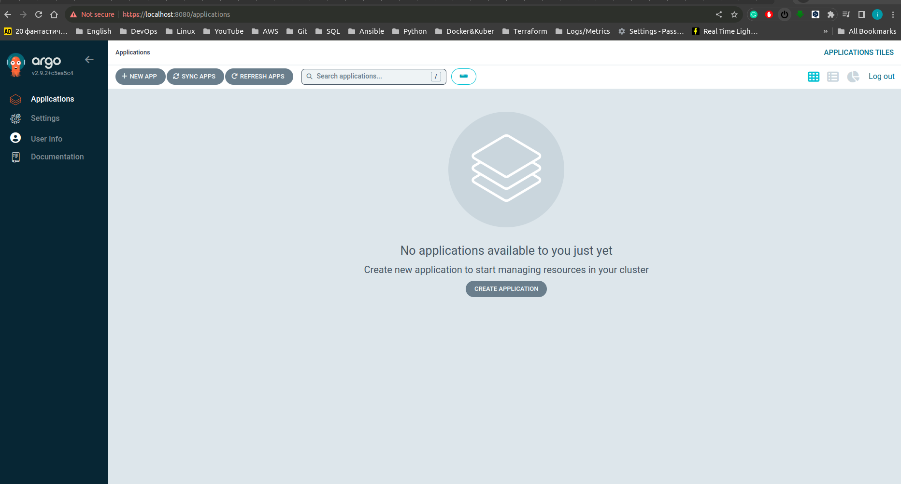

ArgoCD deployment demo

1. Creating "argocd" namspace

```bash
kubectl create ns argocd
```

2. Deploying ArgoCD

```bash
kubectl apply -n argocd -f https://raw.githubusercontent.com/argoproj/argo-cd/stable/manifests/install.yaml
```

3. Port forwarding and logining in ArgoCD

Getting generated by default password

```bash
kubectl -n argocd get secret argocd-initial-admin-secret -o jsonpath="{.data.password}" | base64 -d
```

Port forwarding

```bash
kubectl port-forward service/argocd-server -n argocd 8080:443
```
4. Login to argocd UI (localhost:8080) user: admin pasword got from console - step 3



5. Demo of Argocd deployment in K3d cluster


